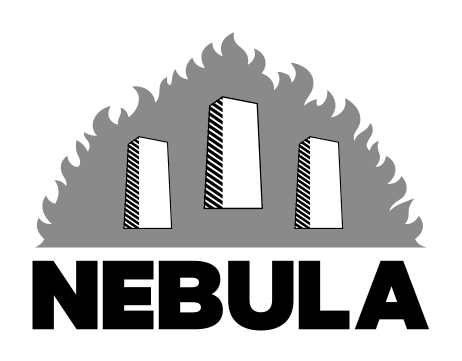

# Introduction

A Nebula spreads from a Dwarf Star (ds4 - <https://github.com/antirez/ds4>). The democratization of the use of large LLMs for local inference takes a step forward towards the private consumer user.

Nebula is built on the Qwen 3.8 Flash Next MoE model, using hardware with 12 GB of Nvidia RTX 4070 Ti VRAM, 128 GB of DDR4 3600Hz RAM and a 14-core i9 9940X CPU, with which the following results were obtained (see the benchmark section):

| Prefill length | Context length | Prefill speed | Generation speed |
| --- | --- | --- | --- |
| 2,048 | 24,576 | 8.43–22.21 token/s | 3.46–14.06 token/s |

With these results, it is possible to guarantee adequate operation for batch work and, with some limitations, real-time interaction with a chatbot as well.

Similar results (even better with more available VRAM and/or better available hardware) can be achieved on workstation hardware typically worth €3–5k or laptops worth €4–6k.

This result comes from decisive architectural choices and targeted optimizations of computation, transfers and state management.

This description is technical up to a point; for everything else, please analyze the code directly or through an AI agent.

## The Logo

  

*To spread the Promethean fire to as many apes as possible, three small monoliths may be better than the larger one. The flames inevitably become less intense as a result.*

## Description

DwarfStar (ds4) provides the technical and methodological starting point. Nebula develops a specialization of it for Qwen3.8-Flash-Next. The following implementations were made on the basis of the ds4 inference engine:

- A native C engine with specialized CUDA kernels for Qwen3.8-Flash-Next, including Gated DeltaNet, Qwen Sparse Attention, Gated Residual, MoE and MTP.

- **Prediction decoding strategy:** the main model (target) is accompanied by its native autoregressive sub-model (MTP), the draft, to quickly generate a chain of tokens. The target model acts as a verifier and replaces the draft model in generation if verification is not satisfied. When a token is rejected, Nebula keeps the preceding accepted tokens and preserves the useful work already done on the rejected token; it does not recalculate projections, router, MoE and output head for the accepted tokens. The MTP is realigned with the accepted prefix.

- **Division of tasks between GPU and CPU:** draft generation in prediction and target verification take place entirely on the GPU. Target generation takes place in hybrid GPU–CPU mode: the CPU executes the entire routed MoE of the layer/batch and returns the vector to the GPU; attention, router, shared experts and head remain on the GPU, limiting transfer bottlenecks over PCIe.

- **Dynamic variation of the draft token window:** based on a reward/punishment system and the time taken.

- **Prioritization of GPU computing resources:** based on calibrated quantizations of the model components and an expert importance ranking (hotlist) by activation and assigned weight. Use of CUDA Graph, which reuses previously recorded sequences of GPU operations, reducing the cost of repeated kernel launches.

- **CPU usage optimizations:** MoE for batches ≤17 with a single OpenMP region using 14 threads, parallelism across rows and weight reuse over tiles of 4 tokens. Specialized Q4_K/IQ4_NL kernels with AVX-512/FMA accumulators, fewer intermediate copies and preservation of the summation order.

- **WebUI with chatbot:** equipped with a chat list, chats that can be deleted and renamed, thinking on/off mode, context length selection, prefill length selection, model accuracy level selection, chat exports in md format and text document uploads.

Like ds4, it supports SSD streaming for allocating the N-gram table (for all configurations except those with 128 GB of RAM) and for allocating the weights of a group of experts (see below).

### How it works:

The prediction decoding strategy avoids the waste caused by using a high-level model when it is unnecessary, relying on the predictions of the speculative MTP model. The iterative steps that lead the model to generate responses are described below:

1. **Initialization:** after prefill, the target produces the first response token, which serves as the input state for the MTP draft model.

2. **Draft-model iteration:** the draft, conditioned on the target state, continues by generating a chain of N tokens, which it then passes to the target for verification. Verification takes place within the GPU, where X/512 experts reside for each layer, selected according to the hotlist (see below). The target router selects 10 experts for each layer, checking which ones are present on the GPU. The experts may be absent; in that case, verification may stop or continue with fewer experts, as specified below. Verification can have three outcomes and corresponding developments:

   - **Case A:** the draft model got all N tokens right.

     - The tokens are confirmed in the response.

     - The target generates the bonus token N+1 on the GPU, which also serves as the new input state for the draft’s new input chain.

     - The draft continues to generate the next N′ tokens, where N′ may be changed relative to N according to the positive progression and the time assessment (see below).

   - **Case B:** for a given token, the verifier did not have enough experts to cover up to 90% of the normalized weights that the router assigns to each expert (expert handoff condition).

     - The preceding confirmed tokens are preserved.

     - That particular token is generated by the entire target MoE on the CPU, and also serves as the new input state for the draft’s new input chain.

     - The draft continues to generate the next N′ = N tokens (the draft token window remains unchanged).

   - **Case C:** for a given token, the verifier has enough experts to cover up to 90% of the normalized weights that the router assigns to each expert, but verification is not satisfied (see the verification criteria below).

     - That particular token is replaced by the one generated by the target MoE on the GPU, already used for verification. This token also serves as the new input state for the draft’s new input chain.

     - The draft continues to generate the next N′ tokens, where N′ may be changed relative to N according to the negative progression and the time assessment (see below).

   In the limiting case where the rejected token is the first one, the length of the next chain is reset to the minimum value N=4.

## Qwen3.8-Flash-Next-Nebula model data

- 125 billion language parameters

- about 6 billion activated per token plus 51 billion in the n-gram table

- 4 billion MTP parameters.

- Shared vocabulary of 248320 tokens.

- Components held on the GPU, quantized as shown in the table (NB: the weights in GiB/GB refer to the reference configuration with X=27 experts per layer resident in VRAM and X+Y=27+485=512 experts per layer resident in RAM):

| Component | Format | GPU GiB | GPU GB |
| --- | --- | --- | --- |
| Target and MTP embedding | Q4_K | 0.333 | 0.358 |
| Target and MTP output head | Q4_K | 0.333 | 0.358 |
| Target expert cache: gate | Q4_K | 1.112 | 1.194 |
| Target expert cache: up | Q4_K | 1.112 | 1.194 |
| Target expert cache: down | IQ4_NL | 1.112 | 1.194 |
| Target: hyper-connection | F32 + IQ4_NL + Q4_K | 0.351 | 0.377 |
| Target: MoE router | F32 | 0.234 | 0.252 |
| Target: shared expert gate | F32 | 0.000458 | 0.000492 |
| GDN: convolution, norms and scales | F32 | 0.006 | 0.006 |
| GDN: alpha and beta projections | F32 | 0.033 | 0.035 |
| PLE: convolution and norms | F32 | 0.000267 | 0.000287 |
| Target: attention norms | F32 | 0.000023 | 0.000025 |
| Target: indexer and its norms | BF16 + F32 | 0.037 | 0.039 |
| GDN: gate, 36 layers | Q4_K | 0.297 | 0.319 |
| GDN: QKV projection, 36 layers | Q4_K | 0.494 | 0.531 |
| Target: shared experts | IQ4_NL + Q4_K | 0.124 | 0.133 |
| GDN: output projection | Q4_K | 0.297 | 0.319 |
| PLE: key and value projections | Q4_K | 0.017 | 0.018 |
| Target: K attention | Q4_K | 0.008 | 0.009 |
| Target: output attention | Q4_K | 0.099 | 0.106 |
| Target: Q attention | Q4_K | 0.198 | 0.212 |
| Target: V attention | Q4_K | 0.008 | 0.009 |
| MTP: K attention | Q4_K | 0.000687 | 0.000737 |
| MTP: attention norms | F32 | 0.000002 | 0.000002 |
| MTP: output attention | Q4_K | 0.008 | 0.009 |
| MTP: Q attention | Q4_K | 0.016 | 0.018 |
| MTP: V attention | Q6_K | 0.001 | 0.001 |
| MTP: shared experts | IQ4_NL + Q4_K | 0.003 | 0.003 |
| MTP: 512 experts, gate | Q4_K | 0.439 | 0.472 |
| MTP: MoE router | F32 | 0.005 | 0.005 |
| MTP: shared expert gate | F32 | 0.000010 | 0.000010 |
| MTP: 512 experts, up | Q4_K | 0.439 | 0.472 |
| MTP: hyper-connection | F32 + Q4_K + Q5_0 + Q6_K | 0.012 | 0.013 |
| MTP: indexer and its norms | BF16 + F32 | 0.003 | 0.003 |
| MTP: input projection and norms | F32 + Q4_K | 0.007 | 0.007 |
| MTP: 512 experts, down | IQ4_NL | 0.439 | 0.472 |
|  | TOTAL | 7.581 | 8.140 |

- Components held on the CPU, quantized as shown in the table:

| Component | Format | RAM GiB |
| --- | --- | --- |
| Target experts in RAM | (see above) | 63.281 |
| PLE table in RAM | (IQ4_NL) | 26.822 |
|  | TOTAL | 90.103 |
| Main CPU buffers |  | 0.292 |

### The hotlist

During development of the engine, following the example of ds4, a campaign analyzing the model’s responses was carried out. The campaign collected 120 requests in 12 domains, with 65,938 input tokens and 43,791 tokens emitted in response. Routing is available for 43,764 response tokens. This made it possible to map, for each layer, the experts’ activation frequency and the weights assigned to them by the router. The ranking was drawn up by activation frequency and, for equal scores, by the assigned weight. This ranking is used to identify the X experts to reside in VRAM and the 512-X-Y experts to reside on the SSD (where Y = experts residing exclusively in RAM).

### How verification takes place

The verifier evaluates the ID proposed by the draft using the target’s logits. This takes place according to criteria that vary with the accuracy required of the response, which the user can set on a graduated scale from 1 to 3 as follows:

**3 — Strict.** Accepts only the token identical to the configured target’s greedy choice. It is the default reference for technical contexts, mathematics, coding and complex reasoning.

**2 — Limited tolerance.** Allows only one non-greedy proposal per block, within the target’s top three tokens and with R ≥ 0.80. It is an experimental option for assessing the trade-off between speed and response variation; it should be compared with level 3 on one’s own tasks. The measured gain depends on the workload; the results of the final campaign are reported in the section dedicated to benchmarks.

**1 — Wide tolerance.** Allows up to four non-greedy proposals per block, provided they are within the target’s top ten and have R ≥ 0.20. An option included for completeness, always discouraged because the gain in speed does not offset the loss of intelligence.

### Dynamic variation of the draft token window.

There is a basic rule, founded on reward/punishment, that proposes a change to the draft token window (changing the number N of tokens that the draft must generate). The proposal is then assessed in terms of its time benefit.

Basic rule: each response starts from N=4 and the controller keeps the window between 4 and 16 proposals. The basic rule rewards fully accepted blocks with increments:

$$
N' = N + \Delta N
$$

With N taking increasing values in the case of consecutive acceptances, according to the progression:

$$
\Delta N = 0,1,1,2,3,5
$$

Whereas in the case of rejections:

$$
N' = N - \Delta N
$$

With N taking increasing values in the case of consecutive rejections, according to the progression:

$$
\Delta N = 2,4,6
$$

This basic rule may be altered where the model, implemented with an algorithm that stores the history of generation, verification, saving, recovery and MTP realignment speeds for entire blocks of N tokens, understands that it is more advantageous to alter N′ by +2/−2 when this makes it possible to achieve (according to the history) higher token/s speeds than those achievable (again according to the history) with the number N′ given by the basic rule. The algorithm that corrects the basic rule requires a generation history of eight token chains.

## Benchmark results

Campaign of September 11–12, 2026: comparison between level 3 (strict greedy) and level 2 (the target’s top three tokens, probability ratio of at least 0.80 and at most one non-greedy proposal accepted per block). The measurements concern the official configuration on the 12 GB RTX 4070 Ti, i9-9940X CPU and 128 GB of RAM.

Configuration kept unchanged: context of 24,576 tokens, prefill of 2,048, 27 resident experts per layer, Q4_K/IQ4_NL expert matrices, N-gram in RAM, 14 CPU threads, layer MoE on the CPU in the event of handoff, 10% threshold for omitting marginal experts, CUDA Graph and intermediate state recovery enabled. Thinking disabled; adaptive MTP window from 4 to 16. The weights remained loaded during the tests.

### Protocol

With NVIDIA GenAI-Perf 0.0.16 and Perf Analyzer 2.60.0, we ran 18 sequential requests: inputs of 512/1,024/2,048 tokens, responses of 128, three repetitions per length and level.

IFEval evaluates 40 questions and 25 types of constraint. The “prompt” score requires all of them to be met; the instruction score evaluates them separately. “Strict” is rigorous, “loose” tolerates differences in presentation.

LiveBench includes 30 questions from November 25, 2024, six each for programming, mathematics, reasoning, language and data analysis. The official graders check responses and programs, also awarding partial scores.

The 70 questions, chosen before the tests, produced 140 evaluated responses, alternating the levels, within 2,048 tokens. The campaign lasted 3.95 hours.

### Performance

| Input (tokens) | Lvl. | Native prefill (token/s) | Native generation (token/s) | GenAI generation (token/s) | First token (s, GenAI) |
| --- | --- | --- | --- | --- | --- |
| 512 | 3 | 20.97 | 6.84 | 6.89 | 25.11 |
| 512 | 2 | 20.86 | 7.66 | 7.69 | 25.19 |
| 1,024 | 2 | 21.18 | 6.87 | 6.87 | 49.01 |
| 1,024 | 3 | 21.05 | 6.82 | 6.16 | 49.25 |
| 2,048 | 3 | 18.49 | 8.04 | 10.14 | 113.94 |
| 2,048 | 2 | 19.18 | 8.22 | 8.23 | 107.45 |

In the NVIDIA tests, moving from level 3 to level 2, generation increases from 7.19 to 7.54 token/s (+4.93%).

Each row summarizes three tests. Nebula measures tokens/processing time; GenAI measures response reception. Prefill includes the input and first token; generation follows. Time to first token measures the wait.

The differences between processing and reception explain the discrepancies in two requests, retained in the results.

| Level | NVIDIA tests, native min–max (token/s) | NVIDIA tests, native average (token/s) | Quality tests, native min–max (token/s) | Quality, native average (token/s) |
| --- | --- | --- | --- | --- |
| 3 | 6.36–8.49 | 7.19 | 3.61–13.70 | 8.87 |
| 2 | 6.71–8.51 | 7.54 | 3.46–14.06 | 9.07 |

In the quality tests, the averages are 8.87 and 9.07 token/s: content and length influence speed and draft acceptances.

At levels 3 and 2, average responses of 509.9 and 500.2 tokens take 71.84 and 69.62 seconds overall.

The 158 responses provide the ranges in the introduction: prefill 8.43–22.21 and generation 3.46–14.06 token/s, measured per response.

Maximum memory detected every 30 seconds: GPU 11.08 GiB, process 90.78 GiB RAM. No expert weight transfers to the GPU.

### Response quality

| Sample measurement | Level 3 | Level 2 |
| --- | --- | --- |
| IFEval: prompt strict | 87.50% | 90.00% |
| IFEval: prompt loose | 90.00% | 90.00% |
| IFEval: instructions strict | 91.67% | 93.33% |
| IFEval: instructions loose | 93.33% | 93.33% |
| LiveBench: Programming (n=6) | 83.33% | 83.33% |
| LiveBench: Data analysis (n=6) | 82.17% | 82.17% |
| LiveBench: Language (n=6) | 33.94% | 35.48% |
| LiveBench: Mathematics (n=6) | 36.55% | 53.21% |
| LiveBench: Reasoning (n=6) | 50.00% | 50.00% |
| LiveBench: average of the five areas | 57.20% | 60.84% |

Out of 70 questions: level 2 better in 3 cases, level 3 in 1; 66 ties, 18 identical responses.

The 2,048-token limit affected 8 responses at level 3 and 7 at level 2, included in the scores.

### Test checking and documentation

The comparison keeps the questions and conditions identical: one request at a time, thinking disabled.

Graders checked against known results, empty programming responses scored zero, programs run in isolation. Checks and corrections are archived.

The `work/qwen/standard_bench_20260911` archive preserves the protocol, revisions and checksums, original questions, all responses, timing traces, judgments and NVIDIA logs. `paired_results.md` presents the question-by-question comparison with links to the complete data; `summary.json` contains the reproducible aggregates and `aggregate.py` recalculates them. The initial integration tests are preserved but excluded from the tables.

Official references: [NVIDIA GenAI-Perf](https://github.com/triton-inference-server/perf_analyzer/tree/main/genai-perf) · [IFEval](https://github.com/google-research/google-research/tree/master/instruction_following_eval) · [LiveBench](https://github.com/LiveBench/LiveBench). The exact revisions and those of the data are recorded in the archive.

## How to install it

Nebula runs the C/CUDA engine in a 64-bit Linux environment. The tested configuration uses Ubuntu on Windows through WSL2. The WebUI is used from the browser.

### Minimum requirements

The minimum requirements are 64-bit Windows on an x86-64 processor, an NVIDIA GPU with at least 8 GB of VRAM, 32 GB of RAM and about 151 GiB free on an SSD for installation. This space is the same for all 16 configurations: it includes the temporary peak during weight preparation and the execution environment. The final weights alone occupy about 94.35 GiB. An Internet connection is required during installation; subsequent use of the chat takes place on the computer.

### Installation

Installation starts by running [NebulaSetup.exe](https://github.com/IvanPanzera/nebula/releases/download/v0.1.0-rc.1/NebulaSetup.exe) and approving the Windows administrator request. The executable automatically completes the following steps, showing progress. It requires intervention only when resources need to be freed, a missing requirement needs to be corrected, an active WSL session needs to be closed or Windows needs to be restarted.

The installer:

- checks the Windows version, the x86-64 processor, virtualization and the NVIDIA driver. It requires Windows 10 build 19045 or later and an NVIDIA driver 570.65 or later; it reports any prerequisites that need updating;

- detects the installed physical RAM, GPU VRAM, physical cores and CPU threads. If multiple NVIDIA GPUs are present, it chooses a single GPU with the most VRAM, without adding together the memory of the different cards;

- selects one of the 16 configurations in the table. RAM and VRAM are considered separately and rounded down: for example, 20 GB of VRAM and 80 GB of RAM use the 16 GB and 64 GB profile (see table);

<table>
<thead>
<tr>
<th>VRAM</th>
<th>No. of GPU experts</th>
<th>Max prefill</th>
<th>Max context</th>
<th>Free VRAM</th>
<th>RAM</th>
<th>No. of CPU experts</th>
<th>No. of SSD experts</th>
<th>N-Gram table</th>
<th>Free RAM</th>
</tr>
</thead>
<tbody>
<tr>
<td rowspan="4">8</td>
<td rowspan="4">11</td>
<td rowspan="4">1024</td>
<td rowspan="4">8192</td>
<td rowspan="4">About 1 GB</td>
<td>32</td>
<td>141(+11)</td>
<td>360</td>
<td>On SSD</td>
<td>About 8 GB</td>
</tr>
<tr>
<td>64</td>
<td>400(+11)</td>
<td>101</td>
<td>On SSD</td>
<td>About 8 GB</td>
</tr>
<tr>
<td>96</td>
<td>501(+11)</td>
<td>0</td>
<td>On SSD</td>
<td>About 27 GB</td>
</tr>
<tr>
<td>128</td>
<td>501(+11)</td>
<td>0</td>
<td>On CPU</td>
<td>About 33 GB</td>
</tr>
<tr>
<td rowspan="4">12</td>
<td rowspan="4">27</td>
<td rowspan="4">2048</td>
<td rowspan="4">24576</td>
<td rowspan="4">About 2 GB</td>
<td>32</td>
<td>124(+27)</td>
<td>361</td>
<td>On SSD</td>
<td>About 8 GB</td>
</tr>
<tr>
<td>64</td>
<td>383(+27)</td>
<td>102</td>
<td>On SSD</td>
<td>About 8 GB</td>
</tr>
<tr>
<td>96</td>
<td>485(+27)</td>
<td>0</td>
<td>On SSD</td>
<td>About 27 GB</td>
</tr>
<tr>
<td>128</td>
<td>485(+27)</td>
<td>0</td>
<td>On CPU</td>
<td>About 33 GB</td>
</tr>
<tr>
<td rowspan="4">16</td>
<td rowspan="4">34</td>
<td rowspan="4">4096</td>
<td rowspan="4">49152</td>
<td rowspan="4">About 3.5 GB</td>
<td>32</td>
<td>114(+34)</td>
<td>364</td>
<td>On SSD</td>
<td>About 8 GB</td>
</tr>
<tr>
<td>64</td>
<td>372(+34)</td>
<td>106</td>
<td>On SSD</td>
<td>About 8 GB</td>
</tr>
<tr>
<td>96</td>
<td>478(+34)</td>
<td>0</td>
<td>On SSD</td>
<td>About 27 GB</td>
</tr>
<tr>
<td>128</td>
<td>478(+34)</td>
<td>0</td>
<td>On CPU</td>
<td>About 33 GB</td>
</tr>
<tr>
<td rowspan="4">24</td>
<td rowspan="4">54</td>
<td rowspan="4">8182</td>
<td rowspan="4">98304</td>
<td rowspan="4">About 5 GB</td>
<td>32</td>
<td>90(+54)</td>
<td>368</td>
<td>On SSD</td>
<td>About 8 GB</td>
</tr>
<tr>
<td>64</td>
<td>348(+54)</td>
<td>110</td>
<td>On SSD</td>
<td>About 8 GB</td>
</tr>
<tr>
<td>96</td>
<td>458(+54)</td>
<td>0</td>
<td>On SSD</td>
<td>About 27 GB</td>
</tr>
<tr>
<td>128</td>
<td>458(+54)</td>
<td>0</td>
<td>On CPU</td>
<td>About 33 GB</td>
</tr>
</tbody>
</table>

Note: with equal RAM, increasing VRAM slightly increases the number of experts on the SSD because of the increased size of the buffers in RAM.

- checks free SSD space and available RAM and VRAM. When a resource is insufficient, it indicates how many GiB are missing and asks for installation to be repeated after freeing them. Temporary usage caused by other applications does not change the selected hardware profile;

- identifies an internal SSD with an NTFS volume for the Nebula folder. It prefers the system drive if space is sufficient; otherwise, it chooses the internal SSD with the most free space. The path will be, for example, `C:\Nebula`. It also checks the space needed on the system drive when the model is placed on another SSD;

- enables or checks WSL2 and the Windows virtualization components. If a restart is needed, it prepares installation to resume at the next Windows login, without forcing an immediate restart;

- configures the WSL RAM limit, leaving the planned reserve for Windows, and disables WSL swap so that distribution between RAM and SSD is governed by the engine’s explicit streaming. It preserves the other settings and a copy of the previous `.wslconfig` file; if a change needs to be applied while other WSL sessions are active, it first asks for them to be closed;

- downloads and verifies the Ubuntu image and creates a dedicated WSL2 environment called Nebula. It automatically prepares the Linux user and program folders, without asking for an account to be created or a password to be set;

- installs or checks Python and creates a dedicated Python environment with the required library versions. It installs the build tools and necessary CUDA components. It does not require Python on Windows or Apache: the WebUI HTTP server is included in Nebula’s Python code;

- compiles the engine for the detected GPU and prepares the AVX-512, AVX2 and scalar CPU paths. The engine selects the one supported by the processor and sets the number of threads according to the available physical cores, up to a limit of 28;

- downloads the weights from the planned revision, checking their sizes and SHA256 checksums. It prepares the official quantizations and combines the components into the files used by the engine. It processes one block of files at a time and deletes temporary source copies only after verifying the result;

- generates the hotlist and applies the planned distribution for each layer: the top X experts in the ranking remain on the GPU; the top H remain in RAM, including copies of those X; experts from position H+1 to 512 remain on the SSD. These are read into a limited temporary buffer when needed;

- sets context and prefill according to the table and places the N-gram on the SSD in profiles with 32, 64 and 96 GB of RAM, or in RAM in the 128 GB profile. It saves the settings so that CLI and WebUI use the same configuration;

- runs numerical checks on the CPU and CUDA paths and verifies the tokenizer, hotlist, index, formats and sizes of the model components. It checks available memory again before declaring installation complete; full loading of the weights takes place at the first chat request;

- creates the Nebula shortcut on the desktop and in the Start menu, as well as the Stop Nebula command in the Start menu. It keeps a detailed log in `%ProgramData%\NebulaSetup`. Partial downloads and already verified model files are reused when installation is repeated after an interruption.

## How to start it

After installation, open Nebula using the desktop shortcut or the Start menu. Ordinary use does not require administrator privileges, opening a terminal or starting Ubuntu manually.

The shortcut starts the server in the dedicated WSL environment and opens the WebUI in the browser at <http://localhost:8090>. If Nebula is already running, it reopens the same interface without starting a second engine.

Create a conversation with New chat, write the message and send it. On the first request, the engine loads the planned components into RAM and VRAM; the WebUI shows the loading phase. This initial time is separate from response generation speed.

Once loading is complete, the model remains available for subsequent requests and new chats. Closing only the browser tab does not stop the engine: you can return to the chat by opening Nebula again.

To stop Nebula and free the memory used by the model, run Stop Nebula from the Start menu. The command stops only the WSL environment dedicated to Nebula. After a shutdown or computer restart, the next use requires the weights to be loaded again; chats saved in the browser remain available.

If startup reports that port 8090 is already occupied by another application, close that application and reopen Nebula. In the event of a startup error, consult `webui-error.log` in the installation folder; if RAM or VRAM is insufficient, free the indicated amount and try again.

## Future developments

- Maintenance and improvements guided by reproducible user reports, specifying hardware, revision, configuration and observed behavior. Requests for new features will be assessed based on usefulness, cost and necessary checks.

- Implement the architecture for AMD, Intel and Apple GPUs.

- Optimize prefill, context, remaining memory and expert distribution for other hardware configurations.

- Extend documentation and testing with contexts and prefill of different sizes.

- Provide benchmarks on the capabilities of this architecture for 16 GB and 24 GB VRAM capacities.

- Possibly implement the architecture for other, larger MoE models with these VRAM capacities available.

## Credits and acknowledgments

I thank the Qwen team for the open model, Unsloth for the GGUF distribution and the authors of llama.cpp and GGML for the formats, quantization tools and reference implementations. Nebula’s development uses AI assistance in writing and reviewing code, under human direction and verification. The project is independent; it retains the credits and license notices of the code from which it derives. The model weights retain their respective distribution terms.

I thank Antirez for his work with ds4 and his educational activity on his YouTube channel, which made me passionate about the world of LLMs and the issues surrounding local inference.
