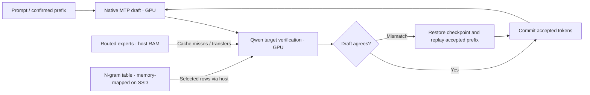

# City of Brass

### Large-model inference on a 12 GB consumer GPU.

**Qwen3.8-Flash-Next · Native C/CUDA · Speculative decoding · Local inference**

[Italiano](README.it.md) · [Setup](qwen/README.md) · [Benchmarks](docs/BENCHMARKS.md) · [Contributing](CONTRIBUTING.md)

City of Brass explores how far a single consumer GPU can go with a large language model. It runs **Qwen3.8-Flash-Next** locally by combining a dedicated C/CUDA engine, native multi-token prediction (MTP), a GPU expert cache and weights held in system memory.

The motivation is simple: make capable, large open-weight models useful on a personal computer, and share the engineering and measurements needed to reproduce the result.

> **Research preview — September 2026.** The measured machine has an **RTX 4070 Ti with 12 GB VRAM and 96 GB system RAM**. The 12 GB figure describes GPU memory. The full model uses host memory and storage as well.

## At a glance

| | Measured or configured |
|---|---|
| GPU | NVIDIA RTX 4070 Ti, 12 GB VRAM |
| System RAM | 96 GB installed; approximately 72–73 GiB process RSS observed |
| Historical decode result | **4.29 committed tokens/s** with MTP N=1; **3.97 tokens/s** without speculation |
| Benchmark scope | Six prompts, 8,192-token context capacity, one text sequence, greedy decoding |
| Current development configuration | 24,576-token context, 2,048-token prefill chunks, 24 cached experts per layer, adaptive MTP N=4–16 |
| Status | Working prototype; final performance and quality validation of the current configuration remains open |

The model family is substantial: Qwen describes **125B language-model parameters with 6B activated, plus 51B n-gram embeddings and a 4B MTP component**. See the [official model card](https://huggingface.co/Qwen/Qwen3.8-Flash-Next). Those published model capabilities and scores are separate from measurements of this quantized implementation.

## What makes this work

The complete weights exceed the GPU's capacity. The engine keeps the dense core, draft, state and a bounded expert cache on the GPU. Routed experts live in host RAM and move to the GPU when needed. The large n-gram table is memory-mapped, with an SSD copy used for row lookups on the measured setup.



- **A model-specific engine.** The implementation follows Flash-Next's Gated DeltaNet, Qwen Sparse Attention, gated residuals, n-gram embeddings and native MTP.
- **All selected experts are evaluated.** The production target uses all ten routed experts plus the shared expert. A cache miss causes a transfer; it does not remove an expert from the computation.
- **Target-verified proposals.** Tokens proposed by the MTP draft are checked against the greedy quantized target. On disagreement, the engine restores state and replays the accepted prefix.
- **Visible costs.** The CLI and WebUI report prefill, committed-token throughput, draft acceptance, prefix reuse and expert transfers.
- **A small implementation to study.** The native path lives in [qwen.c](qwen/qwen.c), [gpu.cu](qwen/gpu.cu) and the [speculative controller](qwen/decode.py), with Python tooling and a local WebUI.

The correctness contract is agreement with the **same quantized greedy target**. It does not establish equivalence to BF16 or implement distribution-preserving stochastic speculative sampling.

## Results so far

Historical comparison on the six original prompts at 8K context capacity:

| Decoding mode | Committed tokens/s | Relative to causal |
|---|---:|---:|
| Causal, N=0 | 3.97 | 1.00× |
| Native MTP, N=1 | **4.29** | **1.08×** |
| Native MTP, N=4 fixed | 3.03 | 0.76× |
| Historical adaptive policy, up to N=4 | 4.28 | 1.08× |

Throughput is total committed decode tokens divided by decode time; it excludes model loading, prefill and the first token predicted during prefill. Larger draft blocks did not consistently improve throughput. The initial load from the measured HDD took about **14 minutes**; the model remains loaded between turns.

The original JSON-format test failed because the answer included Markdown. This failure is retained in the published evidence. A separate 8K retrieval test succeeded, and a subsequent CLI turn reused 8,104 of 8,139 prompt tokens, with approximately 3.29 seconds to the response.

**The table predates the current adaptive N=4–16 policy.** It is not a benchmark of that policy. At 24K, a 24,480-token prefill completed, but the long response was interrupted before retrieval and prefix reuse could be validated. See [methodology, evidence and limits](docs/BENCHMARKS.md).

## Try it

The current target is **Ubuntu/Linux with NVIDIA CUDA**, including the tested Windows + Ubuntu/WSL setup. The build defaults to Ada `sm_89`. This release contains the Qwen engine; support from the original DwarfStar project for other models and platforms is outside this snapshot.

Start with the [setup guide](qwen/README.md). Preparation downloads approximately **113 GB of GGUF files**, then creates derived weights and the optional SSD n-gram cache. Allow additional disk space for these files, the build and operating-system headroom. The guide includes the pinned model revisions and the measured storage layout.

Once the assets and native library are prepared, run from the repository root:

```sh
qwen/build/venv/bin/python qwen/chat.py
# Or start the local browser interface:
qwen/build/venv/bin/python qwen/web_server.py
```

The WebUI serves one model session on `http://localhost:8090`, with streaming responses and per-turn measurements. Model weights are downloaded separately and are not part of this repository. Optional light-model and OCR integrations in the source require separate local assets; they are not configured by the Flash-Next setup.

## Next milestones

- [ ] Measure current adaptive N=4–16 against N=0 and N=1 on identical prompts.
- [ ] Complete 24K retrieval, response quality and multi-turn reuse checks.
- [ ] Reduce expert-transfer cost and measure cache policies on held-out prompts.
- [ ] Extend quantized-target quality comparisons across Italian, coding, reasoning and structured output.
- [ ] Reproduce installation and results on another machine before a stable release.

Speed improvements should preserve routing and state correctness. A fast draft is useful only when the complete proposal-and-verification cycle improves committed-token throughput.

## Origins and credits

This work grew out of experiments with **[DwarfStar / ds4](https://github.com/antirez/ds4)** by Salvatore Sanfilippo and its contributors. **[llama.cpp and GGML](https://github.com/ggml-org/llama.cpp)** provide essential reference implementations, quantization formats and offline conversion tooling. Thanks to the **[Qwen team](https://huggingface.co/Qwen/Qwen3.8-Flash-Next)** for the model and **[Unsloth](https://huggingface.co/unsloth/Qwen3.8-Flash-Next-GGUF)** for the GGUF distribution.

Development uses AI coding assistance, with human direction and local testing. This is an independent project. The code is distributed under the [MIT license](LICENSE), retaining the existing ds4.c and GGML copyright notices. Model weights retain their own upstream terms.

The first public-source candidate is exported from a local working directory without Git history. [Source hashes and scope](docs/source-snapshot.json) identify the copied engine files; historical benchmark numbers are labeled separately from this source snapshot.
